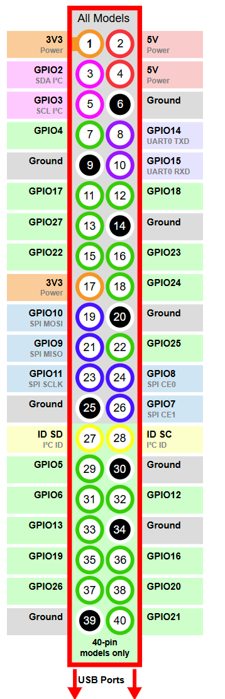
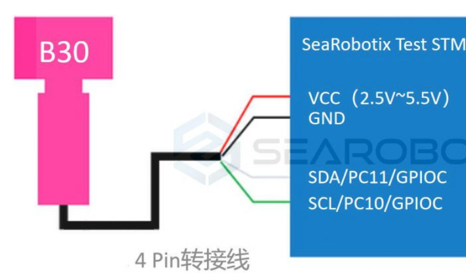

# 项目名称

此部分主要为raspberry读取高度计以及深度计数据测试代码

## 目录

- [参考](#参考)
- [使用](#使用)
## 参考
关于深度计部分，主要参考：
https://github.com/searobotix/ms5837-python
https://searobotix.com/b30/download/b30-sensor-tutorial-stm32/
https://pidoc.cn/gpiozero/recipes
https://github.com/searobotix/ping-python
## 使用
深度计数据传输使用I2C协议，查询手册只有一组I2C接口，注意接线：

之后数据读取部分参考readdata即可

高度计的测试文件为ping-python，其中bluerobotics_ping无法直接安装，目前采用办法为强行安装该包：

`sudo pip install bluerobotics-ping --upgrade --break-system-packages
`

除此之外实测高度计confidence较低，猜测和使用环境有关